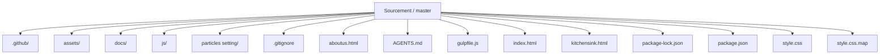
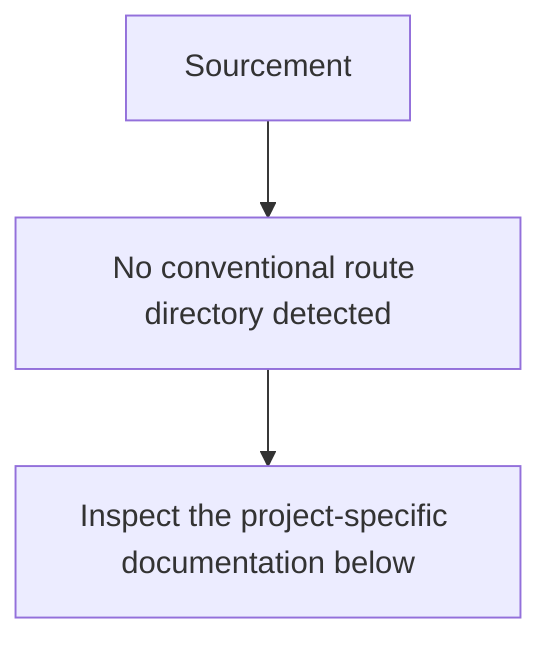
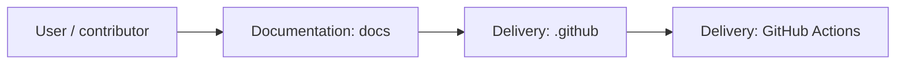
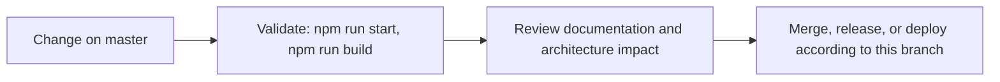

<div align="center">


# Sourcement

<!-- interactive-readme-standard:start -->

> [!NOTE]
> **Branch-specific documentation:** this section is maintained for [`master`](https://github.com/Nischhalsubba/Sourcement/tree/master). It is generated from the files present on this branch and preserves the project-authored README below.

<details open>
<summary><strong>Interactive repository guide</strong></summary>

## Branch overview

| Item | Value |
|---|---|
| Repository | [`Nischhalsubba/Sourcement`](https://github.com/Nischhalsubba/Sourcement) |
| Branch | [`master`](https://github.com/Nischhalsubba/Sourcement/tree/master) |
| Detected stack | Sass, JavaScript, HTML, CSS |
| Detected manifests | package.json |
| Documentation policy | Every maintained branch must explain purpose, setup, structure, architecture, flows, testing, delivery, security, and ownership. |

## Repository structure



The diagram is generated from the branch's actual top-level files and directories. Use the branch link above for complete source navigation.

## Website or application structure



## Application and responsibility flow



## Change-to-delivery flow



## README requirements for this branch

- Explain what this branch contains and how it differs from the default branch.
- Keep installation, configuration, usage, testing, deployment, security, support, and license information accurate.
- Document repository, website or application, API, data, authentication, background-job, and deployment flows when they exist.
- Prefer Mermaid diagrams and expandable `<details>` sections for visual navigation.
- Link diagrams and modules to real source paths; never invent missing components.
- Preserve project-specific documentation and update diagrams whenever architecture or major paths change.
- Treat secrets, private infrastructure, customer data, and credentials as prohibited README content.

</details>

<!-- interactive-readme-standard:end -->

### Resource Management Platform UI

**A lightweight static frontend concept for Sourcement, a resource management platform for tariff-related workflows, built with Gulp automation, modular SCSS, ES6 JavaScript, Glide.js carousel support, and performance-conscious frontend output.**


</div>

---

## ✨ Overview

**Sourcement** is a resource management platform UI concept for tariff-related workflows. The project focuses on a lightweight, custom-coded frontend rather than relying on a heavy third-party design framework.

The project was built with performance, modularity, and maintainability in mind: small CSS output, ES6 JavaScript, modular SCSS, and Gulp workflow automation.

**Demo:**  
`https://nischhalsubba.github.io/Sourcement/`

---

## 🧭 Table of Contents

- [Project Purpose](#-project-purpose)
- [Designer’s Perspective](#-designers-perspective)
- [Technology Used](#-technology-used)
- [Key Features](#-key-features)
- [Performance Notes](#-performance-notes)
- [Run Locally](#-run-locally)
- [Quality Checklist](#-quality-checklist)
- [Roadmap](#-roadmap)
- [License](#-license)

---

## 🎯 Project Purpose

Sourcement is intended to present a structured resource-management interface direction for tariff/resource-related work.

The project can be used as:

- a static UI concept
- a frontend design case study
- a lightweight dashboard/management page reference
- a performance-conscious static frontend example

---

## 🎨 Designer’s Perspective

A resource-management platform should feel organized, clear, and operational.

Important design priorities:

- clear navigation
- readable data/content blocks
- lightweight UI performance
- modular design sections
- responsive layout
- minimal dependency overhead
- scalable styling structure

---

## 🛠 Technology Used

| Tool | Purpose |
|---|---|
| Gulp | Workflow automation |
| SCSS | Modular styling for easier future upgrades |
| ES6 JavaScript | Modern interaction logic |
| Glide.js | Carousel/slider support |
| GitHub Pages | Static demo deployment |

---

## 🌟 Key Features

| Feature | Description |
|---|---|
| Lightweight CSS | CSS output kept under 20KB directionally |
| Small custom JS | App JavaScript kept lightweight |
| Vendor bundle | Vendor JS kept separate from app logic |
| No design framework | Layout does not depend on Bootstrap or similar frameworks |
| No jQuery direction | JavaScript/plugins are ES6-based |
| Modular SCSS | Easier to maintain and upgrade |

---

## ⚡ Performance Notes

Original performance targets:

| Asset | Approx. Size Direction |
|---|---:|
| Main CSS | Under 20KB |
| `App.js` | Around 6KB |
| `Vendor.js` | Around 65KB |

These targets show a strong focus on keeping the frontend lean and fast.

---

## 🚀 Run Locally

Open the static files directly in your browser, or run:

```bash
python -m http.server 8000
```

Then visit:

```text
http://127.0.0.1:8000/
```

---

## ✅ Quality Checklist

- [ ] Demo link works.
- [ ] SCSS compiles correctly.
- [ ] ES6 JavaScript works without jQuery.
- [ ] Carousel behavior works.
- [ ] Main CSS stays lightweight.
- [ ] Layout is responsive.
- [ ] Images are optimized.
- [ ] Content clearly explains the platform purpose.

---

## 🗺 Roadmap

- Add detailed product screenshots.
- Add source folder documentation.
- Add setup commands if Gulp files are included.
- Add accessibility audit.
- Add SEO metadata.
- Add real tariff/resource workflow examples.
- Add case-study explanation for portfolio use.

---

## 📜 License

This project is licensed under the [MIT License](https://choosealicense.com/licenses/mit/).

---

<div align="center">

A lightweight resource-management UI concept built with performance-focused frontend workflow.

</div>
