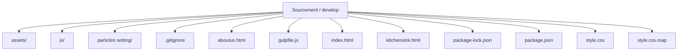
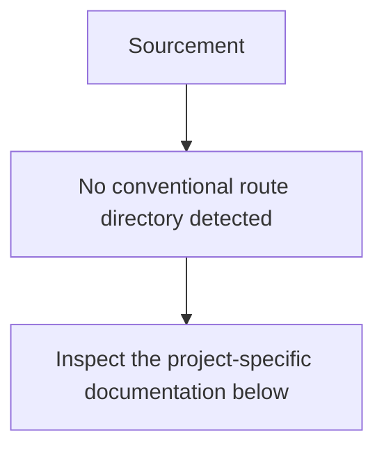
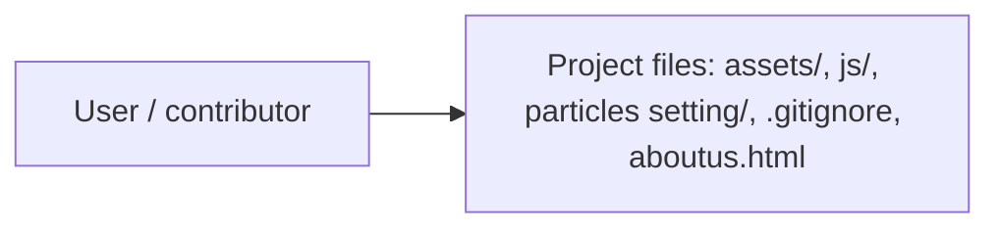
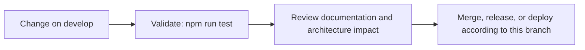

# Sourcement

<!-- interactive-readme-standard:start -->

> [!NOTE]
> **Branch-specific documentation:** this section is maintained for [`develop`](https://github.com/Nischhalsubba/Sourcement/tree/develop). It is generated from the files present on this branch and preserves the project-authored README below.

<strong>Interactive repository guide</strong>

## Branch overview

| Item | Value |
|---|---|
| Repository | [`Nischhalsubba/Sourcement`](https://github.com/Nischhalsubba/Sourcement) |
| Branch | [`develop`](https://github.com/Nischhalsubba/Sourcement/tree/develop) |
| Detected stack | Sass, JavaScript, HTML, CSS |
| Detected manifests | package.json |
| Documentation policy | Every maintained branch must explain purpose, setup, structure, architecture, flows, testing, delivery, security, and ownership. |

## Repository structure

The diagram is generated from the branch's actual top-level files and directories. Use the branch link above for complete source navigation.

## Website or application structure

## Application and responsibility flow

## Change-to-delivery flow

## README requirements for this branch

- Explain what this branch contains and how it differs from the default branch.
- Keep installation, configuration, usage, testing, deployment, security, support, and license information accurate.
- Document repository, website or application, API, data, authentication, background-job, and deployment flows when they exist.
- Prefer Mermaid diagrams and expandable `
` sections for visual navigation.
- Link diagrams and modules to real source paths; never invent missing components.
- Preserve project-specific documentation and update diagrams whenever architecture or major paths change.
- Treat secrets, private infrastructure, customer data, and credentials as prohibited README content.

<!-- interactive-readme-standard:end -->

Sourcement is a Resource Management Platform for Tarrif.

# Technology Used

  - Gulp for automation of the workflow.
  - Glide.js for carousel on website.
  - ES6 for javascript
  - SCSS to make it Modular for future upgrade and Changes.

# Key Features
  - CSS Size under 20KB
  - Javascript size (App.js-6KB),(Vendor.js-65KB)
  - This layout doesn't rely on any 3rd party design framework.
  - The layout doen't even rely on JQuery and all the javascript written or plugins used are ES6 based.
 

# Demo URL:
https://nischhalsubba.github.io/Sourcement/

## License
[MIT](https://choosealicense.com/licenses/mit/)
