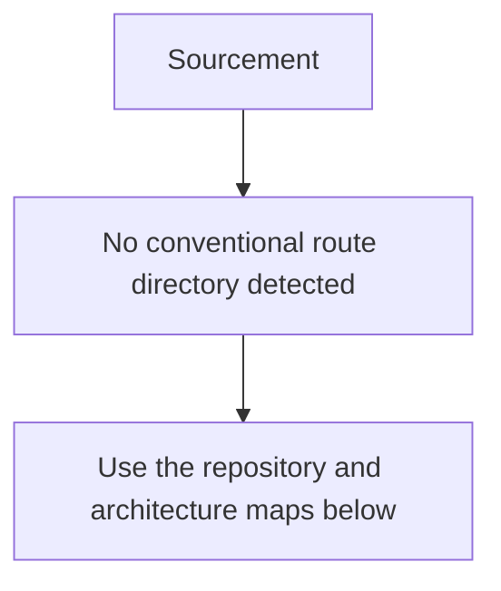
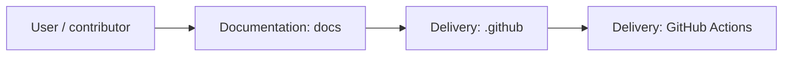
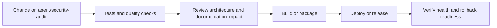
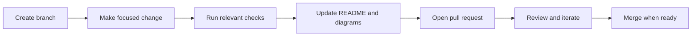

<!-- interactive-readme-standard:start -->

<div align="center">

# Sourcement

**Branch-aware technical guide for [`agent/security-audit`](https://github.com/Nischhalsubba/Sourcement/tree/agent/security-audit)**

<p>     </p>

<p>
  <a href="https://github.com/Nischhalsubba/Sourcement/tree/agent/security-audit"><strong>Browse source</strong></a> ·
  <a href="https://github.com/Nischhalsubba/Sourcement/issues"><strong>Issues</strong></a> ·
  <a href="https://github.com/Nischhalsubba/Sourcement/codespaces/new?ref=agent%2Fsecurity-audit"><strong>Open in Codespaces</strong></a>
</p>

</div>

> [!IMPORTANT]
> This guide is generated from the files actually present on `agent/security-audit`. It links to detected source paths, preserves project-authored notes, and avoids claiming components that were not found.

## At a glance

| Item | Detected value |
|---|---|
| Purpose | Static frontend concept for a tariff resource-management platform, built with SCSS, Gulp, Glide.js, and vanilla JavaScript. |
| Branch role | Compared with `master` |
| Stack | Sass, JavaScript, HTML, CSS |
| Manifests | package.json |
| Prerequisites | Node.js |
| Delivery | GitHub Actions |
| License | No license file detected |

## Branch scope

This branch differs from the default branch in the following detected paths:

- [`.github/workflows/security-audit.yml`](https://github.com/Nischhalsubba/Sourcement/blob/agent/security-audit/.github/workflows/security-audit.yml)
- [`.security-audit-status.txt`](https://github.com/Nischhalsubba/Sourcement/blob/agent/security-audit/.security-audit-status.txt)
- [`.security-install.log`](https://github.com/Nischhalsubba/Sourcement/blob/agent/security-audit/.security-install.log)
- [`README.md`](https://github.com/Nischhalsubba/Sourcement/blob/agent/security-audit/README.md)

## Quick start

```bash
npm install
npm run start
npm run build
```

### Configuration surface

- No committed environment example file was detected.

> Never commit secrets, private keys, production credentials, customer data, or unredacted infrastructure details.

## Repository map

```mermaid
flowchart TD
    ROOT["Sourcement / agent/security-audit"]
    ROOT --> P0[".github/"]
    ROOT --> P1["assets/"]
    ROOT --> P2["docs/"]
    ROOT --> P3["js/"]
    ROOT --> P4["particles setting/"]
    ROOT --> P5[".gitignore"]
    ROOT --> P6[".security-audit-status.txt"]
    ROOT --> P7[".security-install.log"]
    ROOT --> P8["aboutus.html"]
    ROOT --> P9["AGENTS.md"]
    ROOT --> P10["gulpfile.js"]
    ROOT --> P11["index.html"]
    ROOT --> P12["kitchensink.html"]
    ROOT --> P13["package-lock.json"]
    ROOT --> P14["package.json"]
    ROOT --> P15["style.css"]
    ROOT --> P16["style.css.map"]
```



| Responsibility | Detected source paths |
|---|---|
| Documentation | [`docs`](https://github.com/Nischhalsubba/Sourcement/tree/agent/security-audit/docs) |
| Delivery | [`.github`](https://github.com/Nischhalsubba/Sourcement/tree/agent/security-audit/.github) |

## Website or application map



## Architecture and responsibility flow




## Quality, security, and operations

<table>
<tr>
<td width="33%" valign="top">

### Quality

- No conventional test directory was detected automatically.

Detected commands:
- `npm run start`
- `npm run build`

</td>
<td width="33%" valign="top">

### Security

- No dedicated security policy or automated dependency configuration was detected.

Review authentication, authorization, input validation, dependency updates, secret handling, and failure recovery before release.

</td>
<td width="34%" valign="top">

### Observability

- No dedicated observability integration was detected automatically.

Define useful logs, metrics, traces, alerts, and rollback signals for production-facing branches.

</td>
</tr>
</table>

## Delivery flow



### Automation detected

- [`.github/workflows/apply-interactive-readme.yml`](https://github.com/Nischhalsubba/Sourcement/blob/agent/security-audit/.github/workflows/apply-interactive-readme.yml)
- [`.github/workflows/security-audit.yml`](https://github.com/Nischhalsubba/Sourcement/blob/agent/security-audit/.github/workflows/security-audit.yml)

## Contribution flow



- Keep changes focused and explain architectural consequences.
- Run the checks relevant to the changed area.
- Update diagrams whenever routes, modules, data models, authentication, jobs, or delivery paths change.
- Add screenshots or recordings for visual behavior changes when useful.
- Use issues for reproducible defects and pull requests for reviewable changes.

## Ownership and support

| Topic | Source |
|---|---|
| Repository | [`Nischhalsubba/Sourcement`](https://github.com/Nischhalsubba/Sourcement) |
| Branch | [`agent/security-audit`](https://github.com/Nischhalsubba/Sourcement/tree/agent/security-audit) |
| Ownership | No CODEOWNERS file detected |
| Contributing | Use the contribution flow above |
| Support | [Open or review issues](https://github.com/Nischhalsubba/Sourcement/issues) |
| License | No license file detected |

<details>
<summary><strong>Documentation maintenance checklist</strong></summary>

- [ ] Purpose and branch scope are accurate.
- [ ] Setup and configuration commands still work.
- [ ] Repository, application, API, data, authentication, job, and deployment diagrams match the code.
- [ ] Tests, security controls, observability, and rollback behavior are documented.
- [ ] Links point to real files on this branch.
- [ ] No secrets or private operational details are exposed.

</details>

<!-- interactive-readme-standard:end -->

<!-- project-authored-notes:start -->
<details>
<summary><strong>Project-authored notes preserved from this branch</strong></summary>

<div align="center">


# Sourcement

### Resource Management Platform UI

**A lightweight static frontend concept for Sourcement, a resource management platform for tariff-related workflows, built with Gulp automation, modular SCSS, ES6 JavaScript, Glide.js carousel support, and performance-conscious frontend output.**


</div>

---

## ✨ Overview

**Sourcement** is a resource management platform UI concept for tariff-related workflows. The project focuses on a lightweight, custom-coded frontend rather than relying on a heavy third-party design framework.

The project was built with performance, modularity, and maintainability in mind: small CSS output, ES6 JavaScript, modular SCSS, and Gulp workflow automation.

**Demo:**  
`https://nischhalsubba.github.io/Sourcement/`

---

## 🧭 Table of Contents

- [Project Purpose](#-project-purpose)
- [Designer’s Perspective](#-designers-perspective)
- [Technology Used](#-technology-used)
- [Key Features](#-key-features)
- [Performance Notes](#-performance-notes)
- [Run Locally](#-run-locally)
- [Quality Checklist](#-quality-checklist)
- [Roadmap](#-roadmap)
- [License](#-license)

---

## 🎯 Project Purpose

Sourcement is intended to present a structured resource-management interface direction for tariff/resource-related work.

The project can be used as:

- a static UI concept
- a frontend design case study
- a lightweight dashboard/management page reference
- a performance-conscious static frontend example

---

## 🎨 Designer’s Perspective

A resource-management platform should feel organized, clear, and operational.

Important design priorities:

- clear navigation
- readable data/content blocks
- lightweight UI performance
- modular design sections
- responsive layout
- minimal dependency overhead
- scalable styling structure

---

## 🛠 Technology Used

| Tool | Purpose |
|---|---|
| Gulp | Workflow automation |
| SCSS | Modular styling for easier future upgrades |
| ES6 JavaScript | Modern interaction logic |
| Glide.js | Carousel/slider support |
| GitHub Pages | Static demo deployment |

---

## 🌟 Key Features

| Feature | Description |
|---|---|
| Lightweight CSS | CSS output kept under 20KB directionally |
| Small custom JS | App JavaScript kept lightweight |
| Vendor bundle | Vendor JS kept separate from app logic |
| No design framework | Layout does not depend on Bootstrap or similar frameworks |
| No jQuery direction | JavaScript/plugins are ES6-based |
| Modular SCSS | Easier to maintain and upgrade |

---

## ⚡ Performance Notes

Original performance targets:

| Asset | Approx. Size Direction |
|---|---:|
| Main CSS | Under 20KB |
| `App.js` | Around 6KB |
| `Vendor.js` | Around 65KB |

These targets show a strong focus on keeping the frontend lean and fast.

---

## 🚀 Run Locally

Open the static files directly in your browser, or run:

```bash
python -m http.server 8000
```

Then visit:

```text
http://127.0.0.1:8000/
```

---

## ✅ Quality Checklist

- [ ] Demo link works.
- [ ] SCSS compiles correctly.
- [ ] ES6 JavaScript works without jQuery.
- [ ] Carousel behavior works.
- [ ] Main CSS stays lightweight.
- [ ] Layout is responsive.
- [ ] Images are optimized.
- [ ] Content clearly explains the platform purpose.

---

## 🗺 Roadmap

- Add detailed product screenshots.
- Add source folder documentation.
- Add setup commands if Gulp files are included.
- Add accessibility audit.
- Add SEO metadata.
- Add real tariff/resource workflow examples.
- Add case-study explanation for portfolio use.

---

## 📜 License

This project is licensed under the [MIT License](https://choosealicense.com/licenses/mit/).

---

<div align="center">

A lightweight resource-management UI concept built with performance-focused frontend workflow.

</div>

</details>
<!-- project-authored-notes:end -->
