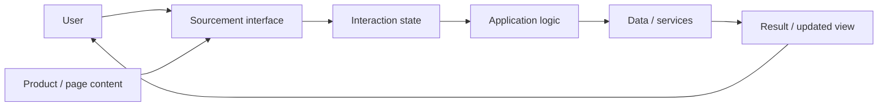
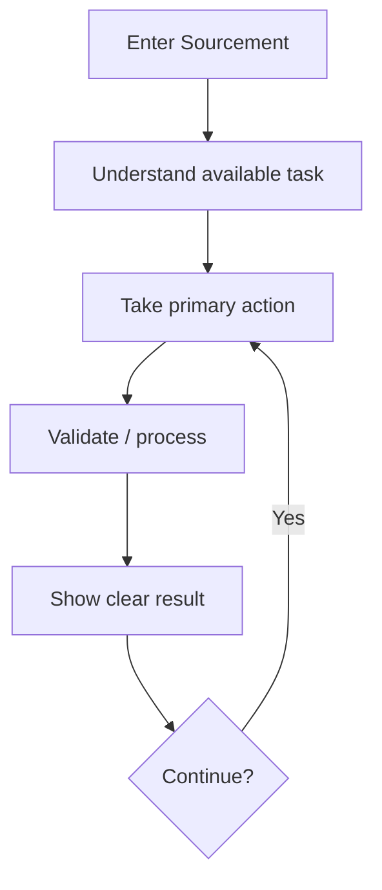
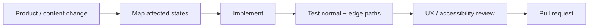

<div align="center">

# Sourcement

**The Sourcement web project, documented around its product experience, interface architecture, user flow, content structure, and maintainable implementation.**


[Browse source](https://github.com/Nischhalsubba/Sourcement/tree/master) · [Issues](https://github.com/Nischhalsubba/Sourcement/issues)

</div>

## Overview

**Sourcement** is documented from the user journey outward: first explain what a person sees and does, then map that experience to interface state, application logic, data or services, and delivery. This keeps the README useful even to people who do not speak framework dialect.

<details open>
<summary><strong>🏗️ Interactive product architecture</strong></summary>



</details>

## User flow



## Audience guide

| Audience | Focus |
|---|---|
| Users / stakeholders | Purpose, available workflows and outcomes |
| Developers | Structure, state, logic, data/services and tests |
| Designers | Hierarchy, responsive behavior, edge states and accessibility |
| Content owners | Accurate terminology, links, metadata and public claims |

## Getting started

```bash
git clone https://github.com/Nischhalsubba/Sourcement.git
cd Sourcement
```

Use the manifests and lockfiles in the repository to determine the current runtime and supported commands.

## Design & accessibility

Keep tasks understandable, errors actionable, loading/empty/success states explicit, focus visible, layouts responsive, and destructive actions clearly distinguished. Document non-obvious workflow rules near the code or product documentation that owns them.

## SEO & discoverability

Public pages should use specific terminology that accurately explains what Sourcement does rather than generic keyword repetition. Maintain unique titles/descriptions, semantic headings, descriptive links, canonical URLs, meaningful image alternatives and social-preview metadata.

## Contribution flow


