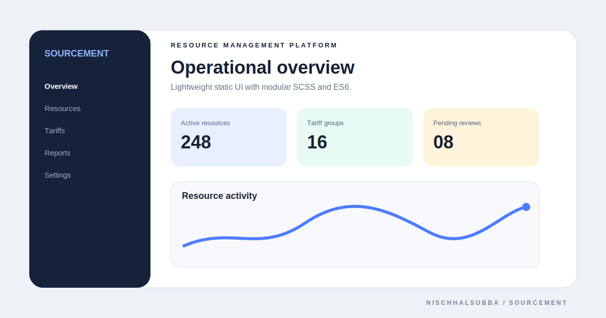

# Sourcement Repository Overview

## Classification

Static resource-management UI concept using Gulp, modular SCSS, ES6 JavaScript, and Glide.js.

- Public demo is documented as GitHub Pages but could not be reverified because DNS was unavailable.
- Historical asset-size goals are targets, not freshly measured results.
- Fresh browser screenshot was not captured.
- The visual above is a local repository thumbnail, not a live-dashboard screenshot.

## Highest-priority checks

1. Verify the GitHub Pages deployment and all static assets.
2. Confirm the documented Gulp workflow and source/output folders.
3. Measure current CSS and JavaScript sizes before repeating performance claims.
4. Add accessibility, responsive, and carousel testing.
5. Replace conceptual tariff data with documented examples or clearly label it as mock content.